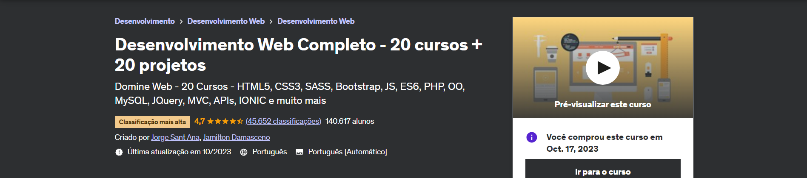

 # Desenvolvimento web - 20 Projetos

   
 

 
 
##### Este repositório foi criado para exibir meus projetos feitos durante o curso Desenvolvimento Web Completo - 20 cursos + 20 projetos da Udemy

### 🤔 Sobre o curso 
O <a  href="https://www.udemy.com/course/web-completo/"> Desenvolvimento Web Completo - 20 cursos + 20 projetos</a> é um curso criado por Jorge Sant Ana e Jamilton Damasceno na plataforma <a  href="https://www.udemy.com/">Udemy</a>, que é um marketplace de cursos online com mais de 213.000 cursos, no curso será ensinado HTML5, CSS3, SASS, Bootstrap, JS, ES6, PHP, OO, MySQL, JQuery, MVC, APIs, IONIC e muito mais. Estarei postando aqui o meu desenvolvimento.
  

### :rocket: Projetos Concluídos (até o momento)

- <a href="https://github.com/kaili0n/Desenvolvimento-web---20-projetos/tree/main/Projeto%20Final%20HTML">Projeto final HTML</a>

- <a href="https://github.com/kaili0n/Desenvolvimento-web---20-projetos/tree/main/Projeto%20Anna%20Bella"> Projeto Anna Bella</a>
